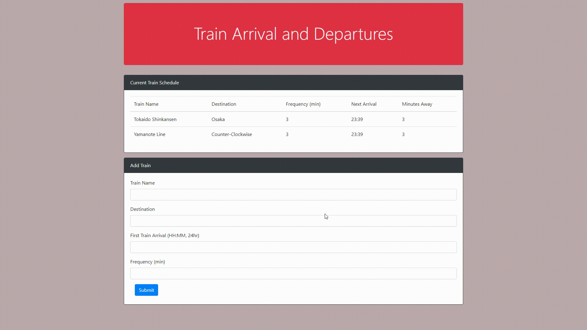

# train-scheduler

This is a site where train schedule is filled in with the form at bottom half of the page. Train name, destination, first departure time, and train frequency is input. The table will output next arrival and next train time for the corresponding train name. 

## Technologies Used

* HTML
* CSS
* Javascript
* jQuery
* moment.js
* Firebase

## Authors

* Alfred Chan